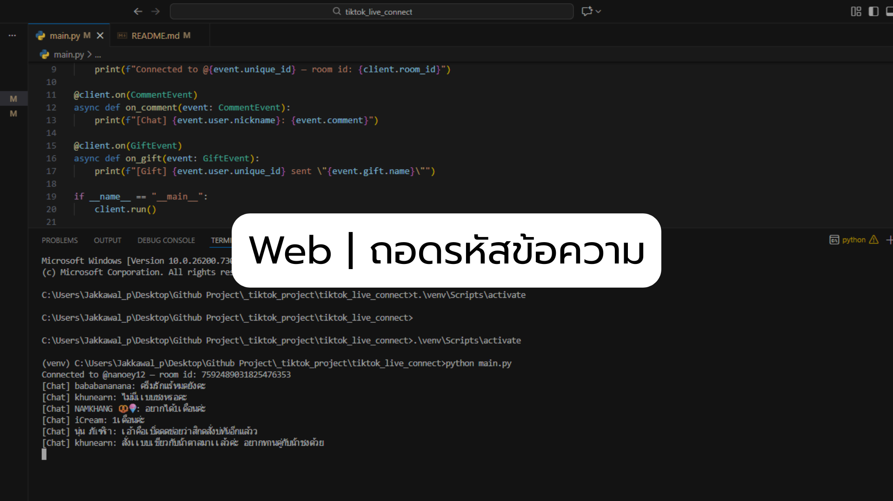
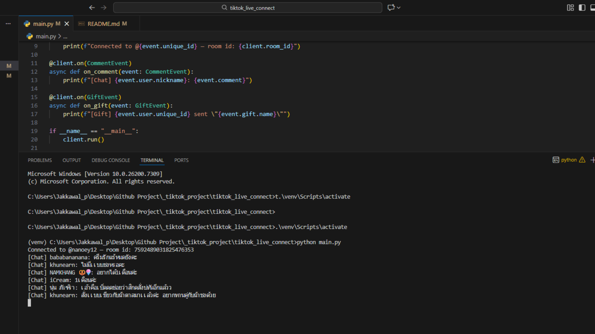
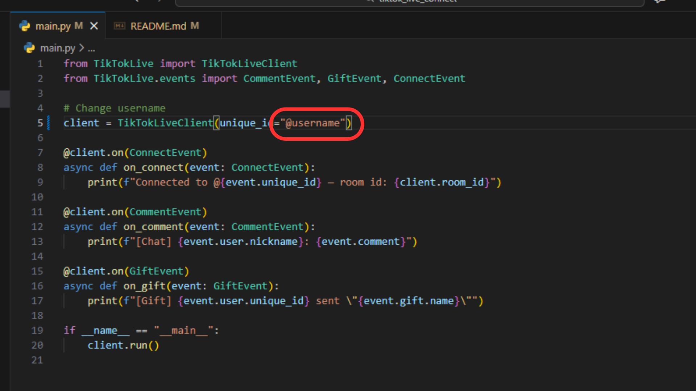
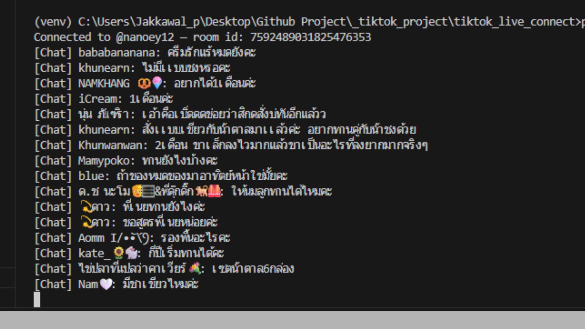

# TikTok Live → Game Input Bot

โปรเจกต์นี้ใช้สำหรับดึงข้อความจาก TikTok Live Chat 

---

# วิธีติดตั้งและใช้งาน

### ตั้งค่า Username
```bash
เปลี่ยนค่า @channlename เป็นช่องที่ต้องการ
```

## Windows (PowerShell)

### 1. สร้าง Virtual Environment
```bash
python -m venv venv
```

### 2. เข้า Virtual Environment
```bash
.\venv\Scripts\activate
```

### 3. ติดตั้ง dependencies
```bash
pip install -r requirements.txt
```

### 4. รันโปรแกรม
```bash
python main.py
```

## macOS / Linux

### 1. สร้าง Virtual Environment
```bash
python3 -m venv venv
```

### 2. เข้า Virtual Environment
```bash
source venv/bin/activate
```

### 3. ติดตั้ง dependencies
```bash
pip install -r requirements.txt
```

### 4. รันโปรแกรม
```bash
python main.py  
```

## Example web




